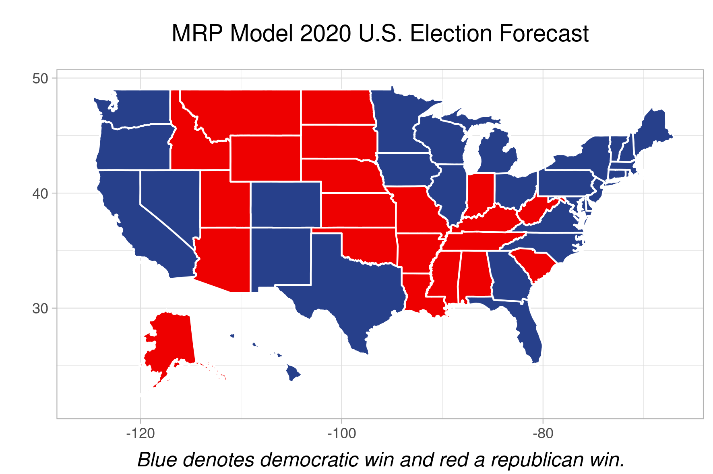
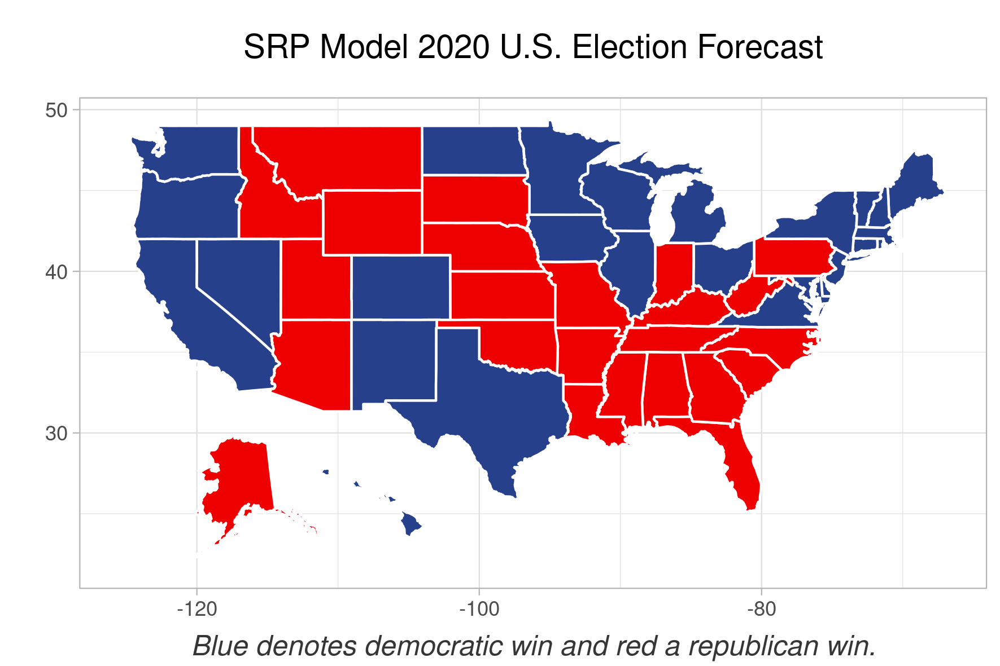

# Forecasting Elections

This repository contains all the code used to generate our
presidential elections forecasts. To accomplish this we used the
two techniques multilevel regression and postratification (MRP)
and stack regression and poststratification (SRP). We used
the Democracy Fund + UCLA Nationscape Survey data to fit our models
and the ACS census data to poststratify our estimates. 

## 2020 U.S. Presidential Elections Forecast
Both our models estimate Joe Biden to win the popular vote. The table below shows our estimates.

### Forecast of Popular Vote Proportions:

| Candidate | **MRP Model** | **SRP Model** | The Economist | Wall Street Journal |
|-----------|---------------|---------------|---------------|---------------------|
| Joe Biden | **52.7%** | **54.4%** | 54.2% | 55% |
| Donald Trump | **47.3%** | **45.6%** | 45.8% | 45% |

### Forecast of Electoral College Votes:

| Candidate | **MRP Model** | **SRP Model** | The Economist | 
|-----------|---------------|---------------|---------------|
| Joe Biden | **401** | **324** | 350 |
| Donald Trump | **137** | **214** | 188 | 

### Forecast of State Victories

## Reproducing Results
We start by asking to follow precisely the instructions layed out in this README

